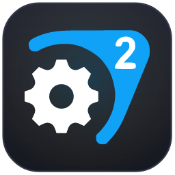
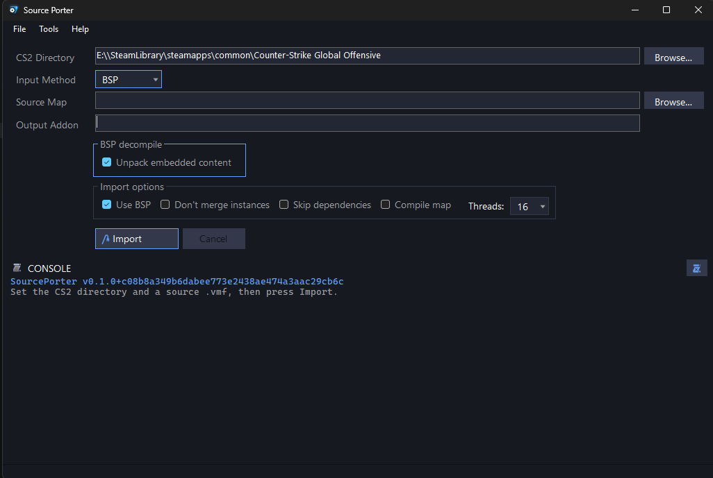

<div align="center">



# SourcePorter

**Port your CS:GO / CS:S maps to Counter-Strike 2**

[](https://github.com/dertwist/SourcePorter/releases/download/dev/SourcePorter.App.exe)
[](#build-from-source)



</div>

---

SourcePorter is a user-friendly app that uses Valve's `import_map_community`
scripts to port maps from CS:GO to Counter-Strike 2.

## Unique Features

- **BSP or VMF input (`.bsp` / `.vmf`).** The program can automatically decompile
  a BSP and port it to Source 2 along with its textures and materials.
- **Fast imports.** By default the port imports all asset *sources* (materials
  and models) without the slow per-asset compile, so you can finish the map in
  Hammer. Tick **Compile Assets** to also compile them to `_c` (needed before
  shipping the addon); **Compile map** bakes the `.vmap_c`.
- **Addon verification.** After a compile it finds missing textures and models
  and reports them in the console.


## Requirements

- **Windows 10 / 11 (64-bit).** Valve's import tools are Windows-only.
- **Counter-Strike 2** with the **Workshop Tools** installed.
- A **CS:GO** install for the original map content.

## Build from source

<details>
<summary>For developers</summary>

You need the [.NET 9 SDK](https://dotnet.microsoft.com/download).

```sh
dotnet build SourcePorter.sln               # build
dotnet run --project src/SourcePorter.App   # launch
dotnet test SourcePorter.sln                # test
```

Design notes live in [overview.md](overview.md), [ARCHITECTURE.md](ARCHITECTURE.md),
and [ROADMAP.md](ROADMAP.md). Contributing? Read [AGENTS.md](AGENTS.md) first.
Never commit real maps or game assets — they're git-ignored, and tests use
synthetic fixtures only.

</details>

## Credits

- [ValveResourceFormat / Source 2 Viewer](https://github.com/ValveResourceFormat/ValveResourceFormat)
  — the dark theme, the UI icons, and the resource format the validator reads.
- [BSPSource](https://github.com/ata4/bspsrc) — the bundled `.bsp` → `.vmf`
  decompiler.
- [ValvePak](https://github.com/ValveResourceFormat/ValvePak) and
  [ValveKeyValue](https://github.com/ValveResourceFormat/ValveKeyValue) — VPK and
  KeyValues reading.
- The S2ZE community and the Map Porting Guide that this tool automates.
